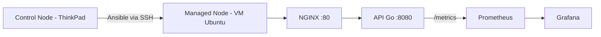

# Projeto Korp - Automação de Stack de Monitorização com Ansible e Docker

Este projeto implementa a automação completa do provisionamento e configuração de uma infraestrutura de monitorização, utilizando **Ansible** como ferramenta de Infraestrutura como Código (IaC) e **Docker / Docker Compose** para orquestração dos serviços. A stack monitora uma API HTTP simples desenvolvida em **Golang**, exposta ao mundo externo através de um proxy reverso **NGINX**.

## Arquitetura do Projeto

O projeto segue a arquitetura padrão de mercado para gerenciamento de configuração:

- **Control Node (Nó de Controle)**: ThinkPad executando Linux, responsável por armazenar os playbooks e disparar as automações via SSH.
- **Managed Node (Nó Gerenciado)**: Máquina Virtual (VirtualBox) executando Ubuntu Server, configurada em modo Bridge, que recebe a stack completa.

A comunicação entre as máquinas é feita através de par de chaves criptográficas SSH, eliminando a necessidade de autenticação interativa por senha durante o deploy.



## API

A aplicação Go expõe o endpoint `GET /projeto-korp`, retornando:

```json
{
  "nome": "Projeto Korp",
  "horario": "2026-08-01T19:25:55Z"
}
```

O campo `horario` é resolvido dinamicamente em UTC a cada requisição. A aplicação também expõe métricas no padrão Prometheus em `/metrics`.

## 📊 Monitorização

- **Volume de requisições**: métrica customizada `http_requests_total`, exposta pela própria aplicação Go via `prometheus/client_golang`.
- **Disponibilidade**: observada através da métrica nativa `up`, gerada automaticamente pelo Prometheus a partir do scrape do target `app-go:8080`.

## Tecnologias Utilizadas

- **Golang**: API HTTP da aplicação monitorada.
- **NGINX**: Proxy reverso, único ponto de entrada externo (porta 80) para o serviço Go.
- **Ansible**: Automatização do deploy, configuração do sistema operacional e garantia de idempotência.
- **Docker & Docker Compose**: Conteinerização e isolamento dos serviços.
- **Prometheus**: Coleta e armazenamento de métricas de séries temporais.
- **Grafana**: Construção de dashboards para visualização de métricas.
- **VirtualBox**: Ambiente de testes com instalação limpa do Ubuntu Server.

## 📂 Estrutura de Diretórios

```
├── ansible/
│   ├── inventory.ini       # Definição dos hosts alvo e variáveis de conexão
│   └── playbook.yml        # Instruções e tarefas automatizadas de provisionamento
├── app/
│   ├── main.go              # API HTTP em Go, expõe /projeto-korp e /metrics
│   └── Dockerfile           # Build multi-stage da aplicação
├── nginx/
│   └── http-server-projeto-korp.conf   # Proxy reverso: porta 80 -> app-go:8080
├── prometheus/
│   └── prometheus.yml      # Configuração de targets do Prometheus
├── grafana/
│   └── provisioning/       # Datasources e dashboards como código
├── docker-compose.yaml     # Definição dos serviços da stack
└── README.md
```

## Execução

Pré-requisito na VM alvo: usuário SSH configurado com chave pública e `sudo` sem exigência de senha interativa (necessário para a automação do Ansible), por exemplo via `/etc/sudoers.d/`:

```
<usuario> ALL=(ALL) NOPASSWD:ALL
```

A partir do Control Node:

```bash
cd ansible
ansible-playbook -i inventory.ini playbook.yml
```

O playbook realiza, em um único comando: instalação do Docker, criação da rede, cópia dos arquivos do projeto, build da imagem da aplicação e subida da stack via Docker Compose.

## ✅ Teste manual

Após a execução do playbook, valide o funcionamento:

```bash
curl http://<IP_DA_VM>/projeto-korp
```

Resposta esperada:

```json
{"nome":"Projeto Korp","horario":"<horário atual em UTC>"}
```

## 🛡️ Notas de Segurança (Hardening)

- **Secrets Management**: nenhuma credencial sensível é armazenada no Git.
- **Isolamento de rede**: a aplicação Go não expõe porta diretamente ao host — todo acesso externo passa obrigatoriamente pelo NGINX.
- **Autenticação**: acesso SSH ao Managed Node feito exclusivamente por par de chaves.
